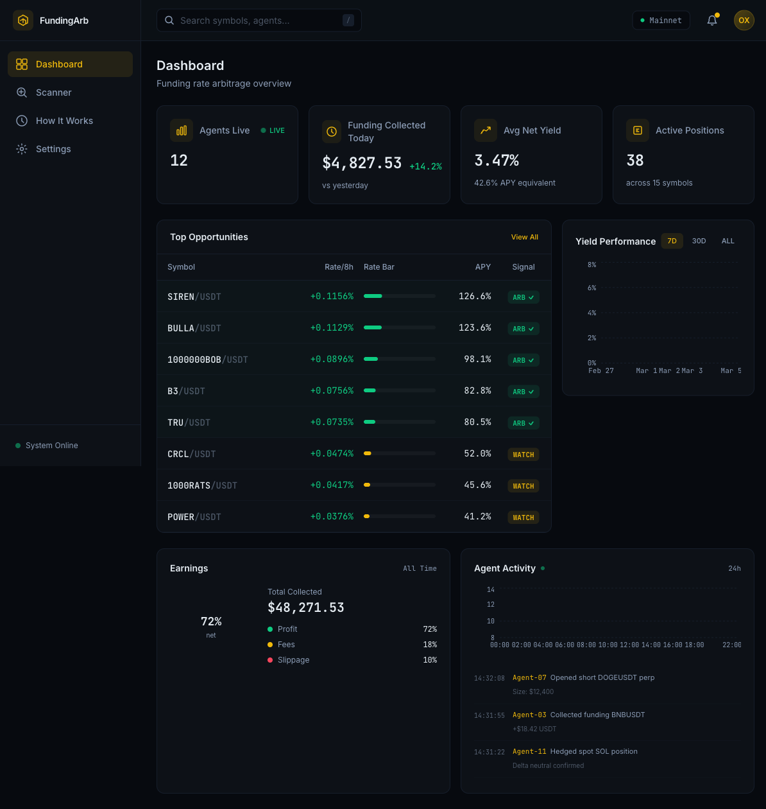
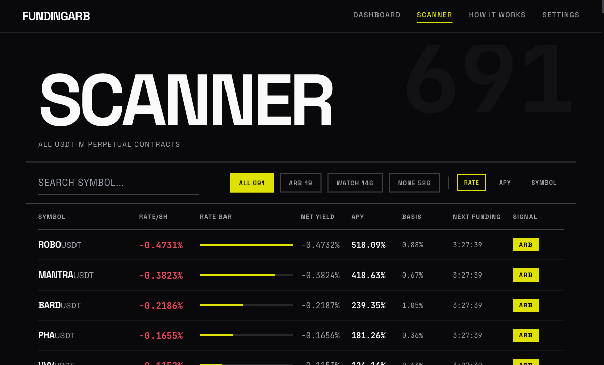

# 花椒套利工具 PEPPER

### Funding Rate Arbitrage Tool for OpenClaw AI Agents

**Delta-neutral 资金费率套利 — 让 AI 替你每 8 小时收一次钱。**

> Spot long + Perp short = collect funding every 8 hours, hands-free.

[](./LICENSE)
[](https://twitter.com/off_thetarget)
[](https://www.binance.com)

---

## Screenshots | 界面截图





---

## Features | 核心功能

### Delta-Neutral 套利策略

- **现货做多 + 永续做空** — 方向对冲，只吃资金费率
- **691+ USDT-M 交易对** 实时扫描，自动筛选最优费率
- **每 8 小时自动结算** — 正费率 = 空头收钱，策略自动执行

### AI Agent 自主执行

- 完整的自主策略 Prompt（`MASTER_SKILL.md`），交给 OpenClaw Agent 即可运行
- Binance Spot 现货 API skill — **15+ 端点**，下单、查余额、盘口
- Binance USDT-M 永续合约 API skill — 覆盖 **32 个端点**
- Binance 钱包划转 API skill — **6 个端点，14 种划转类型**

### 安全第一

- **无 API Key 托管** — Agent 运行在你自己的机器上
- **Self-hosted，开源** — 你的数据留在本地
- 所有操作透明可审计

### Brutalist UI

- **Kinetic Typography** 设计语言
- 酸性黄 `#DFE104` + 暗色主题
- 实时资金费率扫描仪 + 社区统计面板

---

## Quick Start | 快速开始

### 1. Clone 仓库

```bash
git clone https://github.com/yansc153/fundingRate_Arb_Tool.git
cd fundingRate_Arb_Tool
```

### 2. 启动后端 Backend

```bash
cd dashboard/backend
python -m venv venv
source venv/bin/activate        # Windows: venv\Scripts\activate
pip install -r requirements.txt
uvicorn main:app --reload --port 8000
```

### 3. 启动前端 Frontend

```bash
cd dashboard/frontend
npm install
npm run dev
```

打开浏览器访问 `http://localhost:5173`

Open your browser at `http://localhost:5173`

### 4. 配置 AI Agent

将 `MASTER_SKILL.md` 导入你的 OpenClaw Agent，配置 Binance API Key，开始套利。

Import `MASTER_SKILL.md` into your OpenClaw Agent, configure your Binance API Key, and start arbitraging.

---

## Architecture | 系统架构

```
┌─────────────────────────────────────────────────────────┐
│                    PEPPER 系统架构                        │
├─────────────────────────────────────────────────────────┤
│                                                         │
│  ┌───────────────┐         ┌──────────────────────┐     │
│  │   React 前端   │ ◄────► │   FastAPI 后端        │     │
│  │               │  HTTP   │                      │     │
│  │  Vite         │         │  aiosqlite           │     │
│  │  Tailwind CSS │         │  httpx               │     │
│  │  TypeScript   │         │                      │     │
│  └───────────────┘         └──────────┬───────────┘     │
│                                       │                 │
│                                       │ REST API        │
│                                       ▼                 │
│                            ┌──────────────────────┐     │
│                            │   Binance API         │     │
│                            │                      │     │
│                            │  Spot Trading        │     │
│                            │  (15+ endpoints)     │     │
│                            │                      │     │
│                            │  USDT-M Futures      │     │
│                            │  (32 endpoints)      │     │
│                            │                      │     │
│                            │  Wallet Transfer     │     │
│                            │  (6 endpoints)       │     │
│                            └──────────────────────┘     │
│                                                         │
│  ┌──────────────────────────────────────────────────┐   │
│  │              OpenClaw AI Agent                    │   │
│  │                                                  │   │
│  │  MASTER_SKILL.md ──► 自主执行套利策略              │   │
│  │  skills/binance-spot/SKILL.md                    │   │
│  │  skills/binance-futures/SKILL.md                 │   │
│  │  skills/binance-wallet/SKILL.md                  │   │
│  └──────────────────────────────────────────────────┘   │
│                                                         │
└─────────────────────────────────────────────────────────┘
```

---

## Project Structure | 项目结构

```
fundingArb 系统/
├── MASTER_SKILL.md                    # 完整自主套利策略 Prompt
├── skills/
│   ├── binance-spot/
│   │   └── SKILL.md                   # 现货交易 API (15+ endpoints)
│   ├── binance-futures/
│   │   └── SKILL.md                   # USDT-M 永续合约 API (32 endpoints)
│   └── binance-wallet/
│       └── SKILL.md                   # 钱包划转 API (6 endpoints, 14 types)
├── dashboard/
│   ├── frontend/                      # React 18 + TypeScript + Tailwind + Vite
│   └── backend/                       # Python FastAPI + aiosqlite + httpx
├── strategies/                        # 策略文档
├── docs/                              # 补充文档
└── README.md
```

---

## Tech Stack | 技术栈

| Layer | Technology |
|-------|-----------|
| Frontend | React 18, TypeScript, Tailwind CSS, Vite, react-fast-marquee |
| Backend | Python, FastAPI, aiosqlite, httpx |
| Fonts | Space Grotesk, JetBrains Mono |
| Design | Brutalist Kinetic Typography, `#DFE104` acid yellow |

---

## Roadmap | 路线图

### v1 (Current | 当前版本)

- [x] Delta-neutral 资金费率套利策略
- [x] 691+ USDT-M 交易对实时扫描
- [x] Binance Spot API skill (15+ endpoints)
- [x] Binance Futures API skill (32 endpoints)
- [x] Binance Wallet Transfer API skill (6 endpoints)
- [x] Real-time dashboard (React + FastAPI)
- [x] Kinetic Typography brutalist UI

### v2 (Planned | 规划中)

- [ ] **机枪池 Yield Optimizer** — 每 4 小时自动 rebalance 至最高费率交易对
- [ ] **Telegram 推送通知** — 费率异动、开仓/平仓提醒
- [ ] **历史回测** — 90 天数据回测，验证策略收益
- [ ] **多因子信号评分** — 综合费率、成交量、持仓量等指标加权打分

---

## License | 许可证

[MIT](./LICENSE)

---

## Credits | 致谢

Built for the **Binance Skills Competition**.

Follow development updates:

**Twitter / X:** [@off_thetarget](https://twitter.com/off_thetarget)
